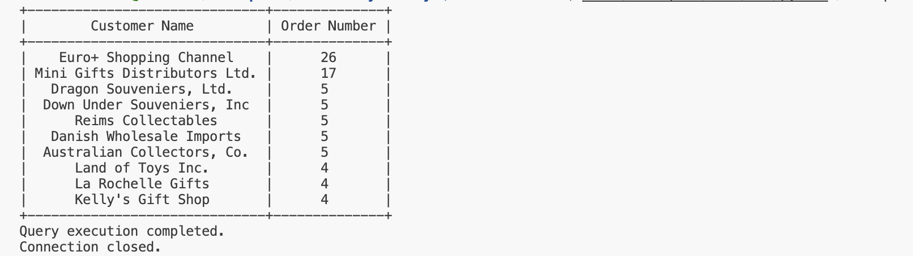
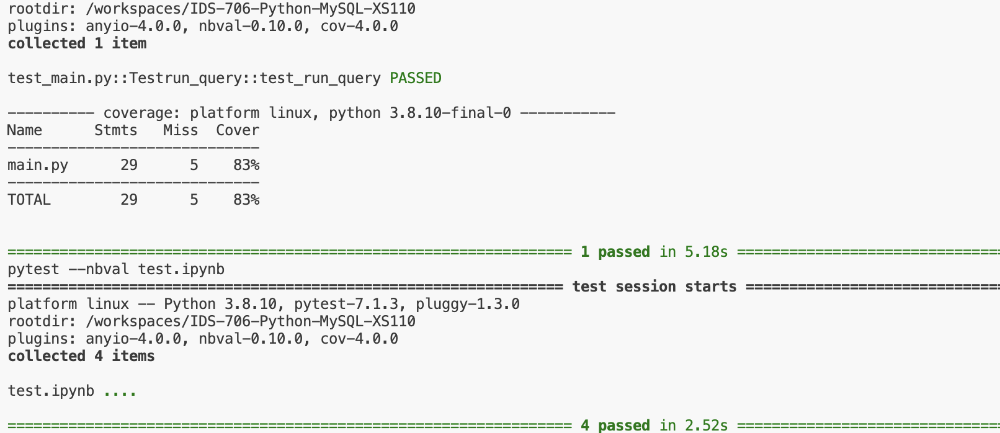

# Python Script interacting with SQL Database

## Setup

I used my python template as a template and made the following modifications: 

### 1. Connect with Databricks

To connect with Databricks, I did the following steps:

1. Get the server hostname of the SQL warehouse. I can get this from the Server Hostname value in the Connection Details tab for  SQL warehouse.

2. Get the HTTP path of the SQL warehouse. 

3. Get a Databricks personal access token for the workspace.


### 2. Update requirements.txt:
``` 
#script
databricks-sql-connector
python-dotenv
tabulate
```
### 3.Update main.py

I updated the main.py using  the Databricks SQL Connector for Python. I have uploaded two csv files to the databricks SQL warehouse, customers.csv and orders.csv. I used Databricks SQL Connector for Python to run a complex SQL query involving joins, aggregation, and sorting.


Here is the specific function:

```python
def run_query():
    try:
        # Replace with your environment variables or provide the actual values
        server_hostname = os.getenv("DATABRICKS_HOST")
        http_path = os.getenv("DATABRICKS_HTTP_PATH")
        access_token = os.getenv("DATABRICKS_TOKEN")

        # Establish a connection
        with sql.connect(
            server_hostname=server_hostname,
            http_path=http_path,
            access_token=access_token
        ) as connection:
            # Create a cursor
            with connection.cursor() as cursor:
                # Define the SQL query
                sql_query = """
                SELECT customerName, COUNT(O.orderNumber) as orderNum
                FROM customers AS C
                LEFT JOIN orders AS O ON C.customerNumber = O.customerNumber
                GROUP BY customerName
                HAVING customerName IS NOT NULL
                ORDER BY orderNum DESC
                LIMIT 10
                """
                # Execute the query
                cursor.execute(sql_query)

                # Fetch the result
                result = cursor.fetchall()


                # Print the result as a table
                headers = ["Customer Name", "Order Number"]
                table = tabulate(result, headers=headers, tablefmt="pretty")
                print(table)
                print("Query execution completed.")
    except Exception as e:
        print(f"Error: {e}")

    finally:
        try:
            # Close cursor and connection
            cursor.close()
            connection.close()
            print("Connection closed.")
        except NameError:
            # Handle the case where the cursor or connection was not defined
            pass

```
## Explanation

This query joined two tables: orders and customers on custermer id, then  retrieved each customer's order count, ordering the results by the count of orders in descending order, finally, limiting the results to the Top 10 most order customers.


## Results

[](https://github.com/nogibjj/IDS-706-Python-MYSQL-XS110/actions/workflows/cicd.yml)


### 1. successful database operations



### 2. passed all tests


### 3. flow chart

