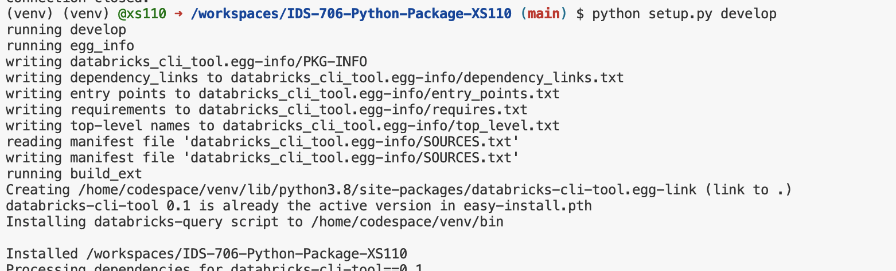

# Package a Python Script into a Command-Line Tool 

## Setup

I used my python template as a template and made the following modifications: 

### 1. Connect with Databricks

To connect with Databricks, I did the following steps:

1. Get the server hostname of the SQL warehouse. I can get this from the Server Hostname value in the Connection Details tab for  SQL warehouse.

2. Get the HTTP path of the SQL warehouse. 

3. Get a Databricks personal access token for the workspace.

I created a .env file

```ini
DATABRICKS_HOST='adb-xxxx'
DATABRICKS_HTTP_PATH='/sql/xxx'
DATABRICKS_TOKEN = 'dapxxx'
```
Then we can use environment variables.


### 2. Update requirements.txt:
``` 
#script
setuptools
databricks-sql-connector
python-dotenv
tabulate
```


### 3.Update mylib.query.py

I updated the query.py using  the Databricks SQL Connector for Python. I have uploaded two csv files to the databricks SQL warehouse, customers.csv and orders.csv. I used Databricks SQL Connector for Python to run a complex SQL query involving joins, aggregation, and sorting. See the specific function in script.


### 3. Create setup.py

I created a setup.py to package the python script `query.py` into a Command-Line Tool 

```python
from setuptools import setup, find_packages

setup(
    name='databricks-cli-tool',
    version='0.1',
    author='Xinyi Sheng',
    author_email='xs110@duke.edu',
    packages=find_packages(),
    install_requires=[
        'databricks',
        'python-dotenv',
        'tabulate',
    ],
    entry_points={
        'console_scripts': [
            'databricks-query = main:main',
        ],
    },
)
```

### 4.update Makefile 

I added two rules:

```
setup_package: 
	python setup.py develop

databricks-query:
	databricks-query
```

so users can use `make setup_package` to install the package in development mode, and use`databricks-query` to get the result.

### 5. update .yml
Here I add to steps to the workflow
```
      - name: install local package
        run: make setup_package
      - name: query
        run: make databricks-query
```

## Results

[](https://github.com/nogibjj/IDS-706-Python-Package-XS110/actions/workflows/cicd.yml)


### 1. install the package



### 2. use the package


### 3. user guide

I wrote an `user_guide.md`

